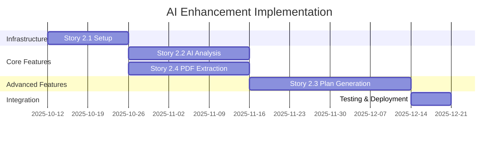
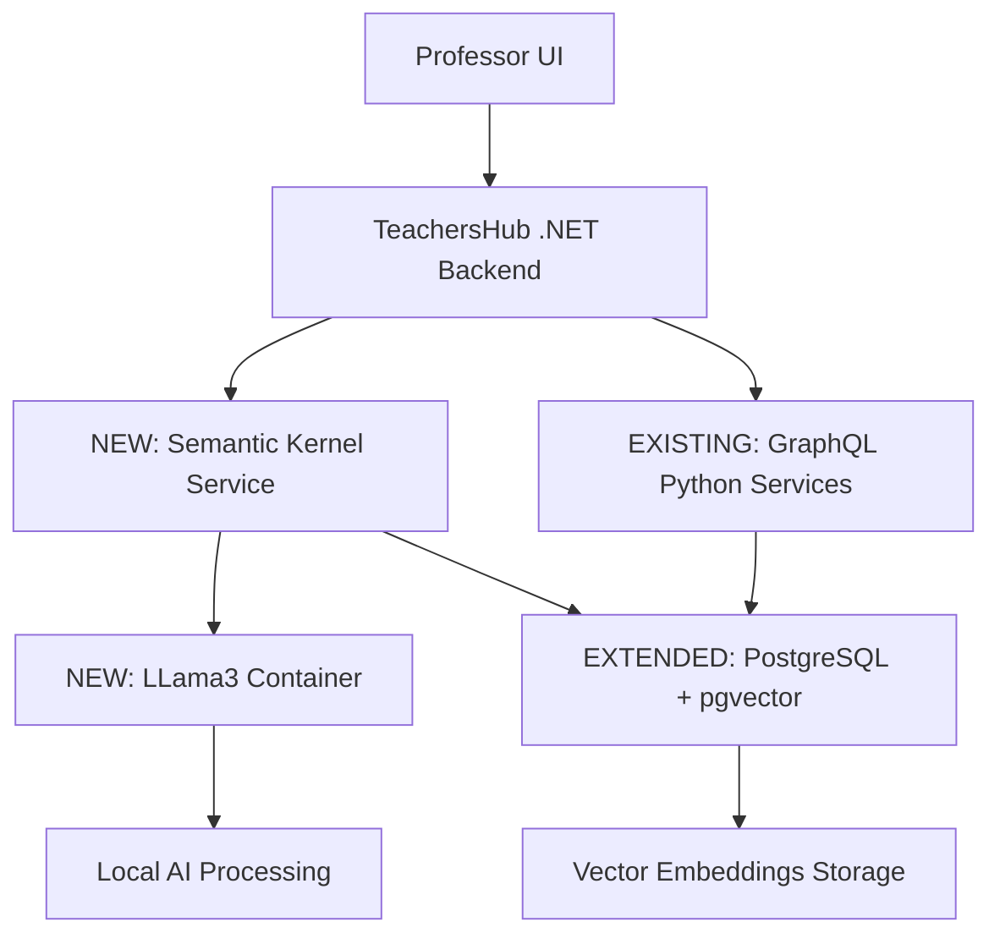

# EPIC: AI-Enhanced ENEM RAG System

## 🎯 Epic Goal

Transform the existing ENEM RAG system into an AI-powered educational platform by integrating Microsoft Semantic Kernel with LLama3, enabling automatic question analysis and lesson plan generation while maintaining full backward compatibility.

## 📋 Epic Overview

### Current State
- **Robust ENEM RAG System** - 2,532 questões, GraphQL API, PostgreSQL backend
- **Revolutionary Parser** - 93.3% extraction improvement achieved
- **Hybrid Architecture** - TeachersHub .NET + Python GraphQL services
- **Production Ready** - Docker containerized, fully functional

### Target State  
- **AI-Powered Analysis** - Automatic difficulty assessment and concept extraction
- **Intelligent Lesson Plans** - AI-generated educational content based on selected questions
- **Enhanced Search** - Semantic vector search capabilities
- **Local AI Processing** - LLama3 running locally for LGPD compliance

## 🚀 Stories Breakdown

### Story 2.1: Semantic Kernel Infrastructure Setup
**Duration:** 2 semanas | **Priority:** Critical | **Dependencies:** None

**Objetivo:** Estabelecer a base de infraestrutura de IA mantendo compatibilidade total

**Key Deliverables:**
- ✅ LLama3 container operacional (`llama3:8b-instruct`)
- ✅ PostgreSQL pgvector extension habilitado
- ✅ Semantic Kernel .NET service integrado
- ✅ Docker Compose orchestration atualizado

**Success Criteria:**
- LLama3 responde em < 10s (warm requests)
- Vector search < 500ms
- Zero breaking changes na arquitetura existente
- Todos os serviços comunicam via Docker network

### Story 2.2: AI-Powered Question Analysis Engine  
**Duration:** 3 semanas | **Priority:** High | **Dependencies:** Story 2.1

**Objetivo:** Implementar análise automática de questões ENEM com IA

**Key Deliverables:**
- ✅ Automatic difficulty classification (1-5 scale)
- ✅ Concept extraction per question
- ✅ Teaching strategy suggestions
- ✅ GraphQL API extensions (`aiAnalysis` field)

**Success Criteria:**
- 85%+ accuracy em avaliações pedagógicas
- Análise individual < 3s, batch < 30s
- Cache hit rate > 90%
- Professor feedback loop operacional

### Story 2.3: AI-Powered Lesson Plan Generation
**Duration:** 4 semanas | **Priority:** High | **Dependencies:** Stories 2.1, 2.2

**Objetivo:** Gerar planos de aula completos baseados em questões selecionadas

**Key Deliverables:**
- ✅ Question-based lesson plan generation
- ✅ Customizable parameters (duration, audience, objectives)
- ✅ Multiple export formats (PDF, Word, Markdown)
- ✅ TeachersHub integration com storage/sharing

**Success Criteria:**
- Plan generation < 30s para até 10 questões
- Plans follow recognized pedagogical methodologies
- Full customization capabilities
- Professional export formatting

### Story 2.4: AI-Enhanced PDF Extraction Engine
**Duration:** 3 semanas | **Priority:** Critical | **Dependencies:** Story 2.1

**Objetivo:** Revolucionar extração de PDFs usando IA para superar os 93.3% atuais

**Key Deliverables:**
- ✅ Hybrid parsing (Traditional + AI validation)
- ✅ Missing question detection com LLama3
- ✅ Automatic question repair capabilities
- ✅ Quality metrics dashboard comparativo

**Success Criteria:**
- >98% extraction rate (vs 93.3% atual)
- >95% complete questions com 5 alternativas
- <2x processing time overhead
- <5% questions requiring manual review

## 📊 Implementation Timeline

**Total Duration:** ~12 semanas (3 meses)
**Resource Estimate:** 1 Full-Stack Developer + 1 AI Integration Specialist

## 🏗️ Technical Architecture Summary

### Integration Strategy: **Aditivo + Zero Breaking Changes**

### Key Technical Decisions

1. **Local AI Processing** - LLama3 runs containerized, no external APIs
2. **Backward Compatibility** - All existing APIs remain unchanged
3. **Progressive Enhancement** - System works 100% without AI active
4. **Performance First** - Caching strategy ensures responsive UX

## 🎓 Educational Value Propositions

### For Teachers
- **Time Savings:** Planos de aula em minutos ao invés de horas
- **Quality Insights:** Análise pedagógica automática de questões  
- **Customization:** Personalização total mantendo qualidade profissional
- **ENEM Alignment:** Conteúdo sempre alinhado com competências ENEM

### For Students  
- **Better Preparation:** Aulas estruturadas com foco em dificuldades específicas
- **Concept Clarity:** Estratégias pedagógicas otimizadas por IA
- **Progressive Learning:** Questões balanceadas por nível de dificuldade
- **Real ENEM Context:** Preparação com questões reais e contextualizadas

## 📈 Success Metrics

### Technical KPIs
- **System Uptime:** 99.5%+ com AI features ativas
- **Response Time:** < 3s análise questão, < 30s geração plano
- **Cache Hit Rate:** > 90% para análises IA
- **Error Rate:** < 1% falhas geração conteúdo

### Educational KPIs  
- **Analysis Accuracy:** 85%+ precisão em avaliações pedagógicas
- **Teacher Adoption:** 70%+ professores usando features IA (3 meses)
- **Time Savings:** 80%+ redução tempo criação planos de aula
- **Content Quality:** 90%+ satisfação qualidade planos gerados

### Business KPIs
- **Feature Usage:** 60% DAU using AI features (6 meses)
- **Content Generation:** 1000+ planos gerados/mês
- **Question Analysis:** 100% base questões analisadas
- **Teacher Retention:** +20% retention com AI features

## 🛡️ Risk Management

### Technical Risks

| Risk | Probability | Impact | Mitigation |
|------|-------------|--------|------------|
| LLama3 Performance | Medium | High | Load testing + fallback strategies |
| Memory Constraints | Medium | Medium | Resource monitoring + optimization |
| AI Output Quality | Low | High | Extensive prompt engineering + validation |
| Integration Complexity | Low | Medium | Incremental development + testing |

### Educational Risks

| Risk | Probability | Impact | Mitigation |
|------|-------------|--------|------------|
| Pedagogical Accuracy | Medium | High | Teacher validation loop + iterative improvement |
| Content Appropriateness | Low | High | Content filtering + review process |
| Over-reliance on AI | Medium | Medium | Teacher customization capabilities |

## 🚀 Post-Epic Roadmap

### Phase 4: Advanced Features (3-6 meses)
- **Semantic Search Enhancement** - Vector-based question discovery
- **Multi-modal Support** - Image analysis for visual questions
- **Adaptive Learning** - Personalized difficulty progression
- **Collaborative Features** - Teacher plan sharing and collaboration

### Phase 5: ML Optimization (6-12 meses)  
- **Model Fine-tuning** - ENEM-specific model training
- **Performance Optimization** - Custom model deployment
- **Advanced Analytics** - Teacher and student learning insights
- **Integration Expansion** - Other educational datasets

## 📚 Dependencies & Prerequisites

### External Dependencies
- **Docker + nvidia-container-runtime** - GPU support for LLama3
- **PostgreSQL 14+** - Vector extension support
- **ASP.NET Core 8** - Latest framework features
- **React 18** - Frontend component updates

### Team Requirements
- **Full-Stack Developer** - .NET + Python + Docker expertise
- **AI Integration Specialist** - Semantic Kernel + LLama3 experience  
- **Educational Consultant** - ENEM + pedagogical methodology knowledge
- **QA Engineer** - AI system testing experience

## 🎯 Definition of Done - Epic Level

### Technical Completion
- [ ] All 3 stories completed and deployed
- [ ] Full integration testing passed
- [ ] Performance benchmarks met
- [ ] Documentation complete (setup, usage, troubleshooting)

### Educational Validation
- [ ] 50+ sample questions analyzed with teacher validation
- [ ] 10+ lesson plans generated and reviewed by educators
- [ ] Pedagogical methodology alignment confirmed
- [ ] ENEM competency mapping validated

### Production Readiness
- [ ] Monitoring and alerting configured
- [ ] Backup and recovery procedures tested
- [ ] Security review completed
- [ ] Teacher training materials prepared

---

**Epic Status:** Ready for Implementation
**Next Action:** Begin Story 2.1 - Semantic Kernel Infrastructure Setup
**Champion:** Winston (Architect) + Development Team

*Este epic representa a evolução natural do sistema ENEM RAG existente, agregando valor educacional significativo mantendo a robustez e confiabilidade já estabelecidas.*